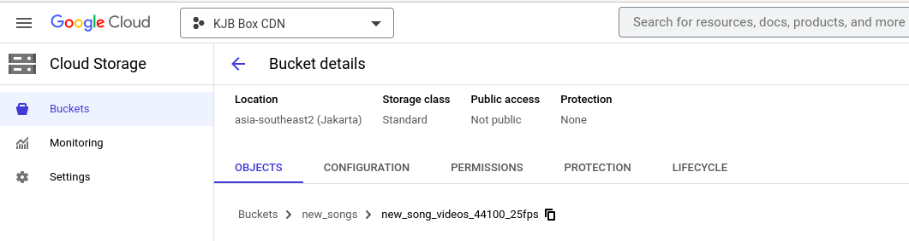
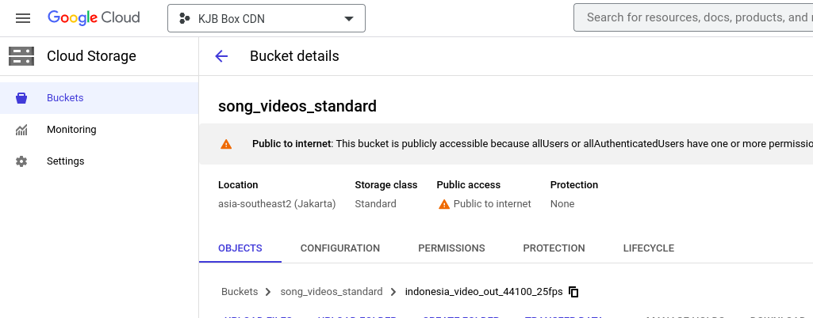
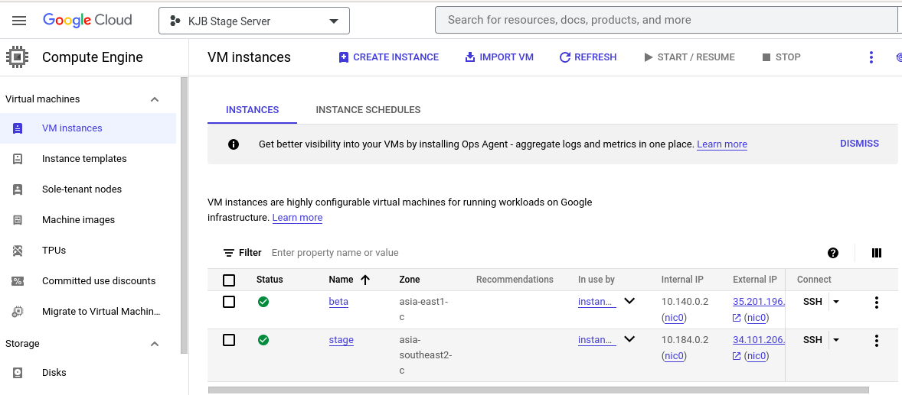
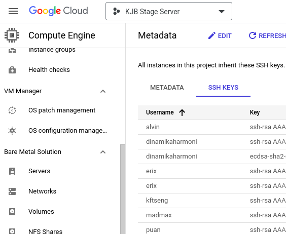
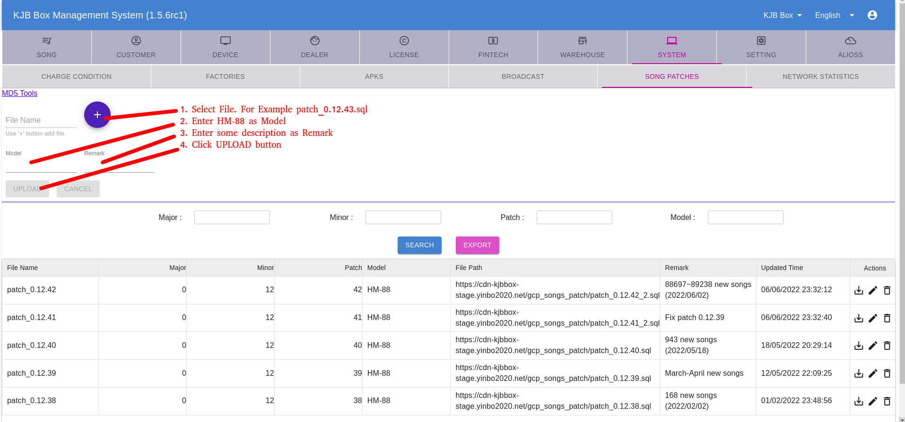

### Perodure

* Convert song file to m3u8 format.
* upload new song file to GCP storage by gsutil

  
   
* Add song information by CMS (TW Server).
* Check new song content is corrected by CMS.
* Copy new song file to online storage by gsutil



* Remote login in  GCP VM of TW Server by SSH.

The VM name of TW Server is stage and IP is 34.101.206.74
    

    
If you cannot use ssh to log in to the remote, add ssh-key to Metadata of GCP VM.
    


* Dump song database from GCP VM of TW Server.

```
    alvin@local$ ssh 34.101.206.74
    ...
    alvin@stage:~$ sudo docker exec -ti pgsql /bin/bash
    root@pgsql:/# su postgres
    postgres@pgsql:/$ cd
    postgres@pgsql:/$ mkdir -p db
    postgres@pgsql:/$ rm -rf ./db/*
    postgres@pgsql:/$ vacuumdb -af
    postgres@pgsql:/$ pg_dump -d song -O -f ~/song.dump
    postgres@pgsql:/$ cp ~/song.dump db
    postgres@pgsql:/$ tar -zcvf db_$(date +'%Y%m%d_%H%M').tar.gz db
```

* Extract song table from database dump file.
    
```
    copy this tar.gz file to local compute
    copy song.dump to {song_repository}/db
    
    alvin@local:{song_repository}$ bash restore_origin_songs.bash
    alvin@local:{song_repository}$ bash dump_to_csv.bash
    alvin@local:{song_repository}$ bash backup_from_db.bash
```

* Commit new song table to git repository and set a version tag.
    
```
    git commit the changed files and add tag (for example 0.12.43)
```

* generate patch script from git repository.

```
    alvin@local$ bash generate_patch.bash
    alvin@local$ bash generate_cloud_patch.bash
```

* update song patch by Song patches of CMS of TW Server.



* Reboot STB (TW Server version). check song patch version and request new song.

* update song database of IDN server.
* update song patch by Song patches of CMS of IDN Server.


First Try:

1. generate_patch.bash
2. generate_cloud_patch.bash
3. storage.bash (copy song files from new song area to online area) 

## storage.bash

1. Generate bash file to copy song files to online area.
2. Shall be install gsutil
3. Modify start kjbcode and end kjbcode in storage.basdh to generate cp_to_storage.bash
4. run cp_to_storage.bash
5. Confirm that the song can be played on the CMS


====================================================================


* 此程序需要在 linux 環境下執行，需要安裝 postgres 套件，建議是 12 版。
* dump_to_csv.bash: 將 song.dump 分離出歌曲, 歌手以及類別的表格 （csv）。
* generate_patch.bash: 指定 Tag 產生歌庫的更新指令稿。 
* 更新指令稿會出現在 release 目錄內。
* db/song.dump 和 db/youtube.dump 都是從 tw server 備份出來的，常用的指令如下：

```
//進入資料庫 CONTAINER
$ sudo docker exec -ti pgsql /bin/bash

//在本機與 CONTAINER 中複製檔案
$ sudo docker cp

// 在 CONTAINER 中 備份資料庫
# su postgres
$ cd
$ mkdir -p db
$ rm -rf ./db/*
$ vacuumdb -af
$ pg_dump -d song -O -f ~/song.dump
$ cp ~/song.dump db
$ tar -zcvf db_$(date +'%Y%m%d_%H%M').tar.gz db

```

* 從 .dump 檔刷新 origin_songs database

```shell
# song
bash restore_origin_songs.bash

# YouTube
bash restore_origin_youtube.bash
```

* 從 origin_songs database 產生 csv 檔案

```shell
bash dump_to_csv.bash
```

* 產生 song patch file

```shell
# For tag 0.x.x
bash generate_patch.bash

# For tag 1.x.x
bash generate_patch_with_new_flag.bash
```

* 產生 cloud song patch file

```shell
bash generate_cloud_patch.bash
```

* 從 origin_songs database 備份 song dump 檔

```shell
bash backup_from_db.bash
```
* 從 origin_songs database 備份 youtube dump 檔

```shell
bash backup_youtube_from_db.bash
```
* 從 origin_songs database 產生 YouTube 表格資料

```shell
bash generate_youtube_data.bash
```

* 從 YouTube 表格資料更新資料庫

```
bash restore_youtube_from_table.bash
```

* 產生雲端歌檔的更新程序

```
bash storage.bash
```

